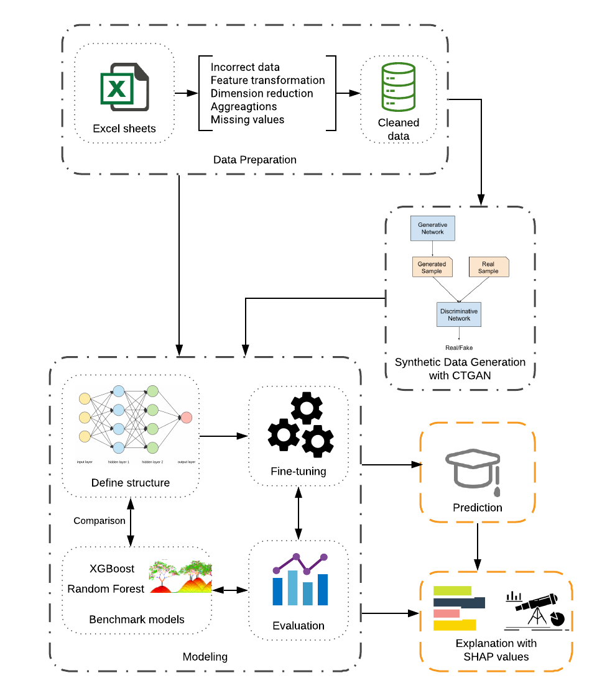

# interpretable-dl

Big homework project by team InterpretableDL, for the _Deep Learning in Practice with Python and LUA_  (VITMAV45) course of Budapest University of Technology and Economics (2019 fall).
Team members:
  * Marcell Nagy
  * Máté Baranyi
  * Tekla Kiss
  
  The detailed documentation of this project can be found in the pdf file, called [InterpretableDL_documentation](./InterpretableDL_documentation.pdf).
  
## Final updates

  * Folders Milestone 1 & 2 are kept for historical reasons only.
  * Folder ```original_notebooks``` contain our main notebooks but these are not executable since our real dataset is not uploadable.
  * Folder ```simulated_data_and_notebooks``` contains a simulated dataset generated by CTGAN. The notebooks in this folder are copies of the ones in the previous folder but these are exectuable on the simulated dataset (for testing purposes), irrelevant lines are deleted or commented out in these notebooks.

***
__Some jupyter notebooks are also exported as HTMLs, and can be found [in this folder](./original_notebooks/htmls%20with%20the%20original%20outputs)__
***

## How to test the notebooks on the simulated data

  1. Clone the repository
  2. ```cd``` into the cloned folder
  3. Build the image with the docker file
    
    docker build interpretable-dl .  
    
  (the docker file will copy the contents of the simulated folder, so it is not neccessary to mount the folders of the cloned repo)
  
  4. Initialize a container
    
    docker run -it --rm -p 8888:8888 interpretable-dl
  5. Run an ```ls``` to see the copied content
  6. Start jupyter (lab or notebook)
    
    jupyter notebook --no-browser --allow-root --ip 0.0.0.0

<hr>

## The workflow of this project




## Interpretability

A key issue and one of the hottest topics in machine learning nowadays is model interpretability and explainability, especially if there are implications associated with the model’s prediction [(Molnar 2018)](https://christophm.github.io/interpretable-ml-book/). in this project for model interpretation, we use a state-of-the-art technique, namely SHAP (SHapley Additive exPlanations) values [(Štrumbelj & Kononenko 2014)](https://link.springer.com/article/10.1007/s10115-013-0679-x); [(Lundberg & Lee. 2017)](http://papers.nips.cc/paper/7062-a-unified-approach-to-interpreting-model-predictions.pdf) , that is  based on the game-theoretical concept of Shapley value .

In this project we use the [shap python module](https://github.com/slundberg/shap) for calculating the SHAP values, and check out other baseline methods as well.

## Data description

To follow the rest of the project, it is important to understand the education system in Hungary, in particular the university admission process, in this section we give a brief overview.

In Hungary, secondary education consists of 4 (sometimes 5) years of schooling, preceding 8 years of elementary education and followed by higher education. Like several other countries, a five-point grading scale is used for grading, where (1) is the failing grade and (5) corresponds to excellent. At the end of the high school studies, students take a centralized exit exam called "érettségi", means maturity diploma or matura, that consists of five exams of core subjects: Mathematics, Hungarian Language and Literature, History, a chosen Foreign Language and one subject of the students' choice that they have been learning for at least 2 years. The students can decide whether they take the exam of a subject at normal or at advanced level.

The admission to higher education in Hungary mostly rely on the secondary school performance of the students and in particular the results of their matura. Students applying to colleges in Hungary gain a unversity enrtance score (UES) based on three factors: grades in secondary school and matura results (study points - SP), results of the maturity exams from two subjects required by the given university program (matura points - MP) and extra points (EP) for additional achievements (e.g. taking advanced-level matura exams, having certificate of a foreign language, earning a prestigious place in sport, art or academic competitions) and equal opportunity points (having disability, disadvantage, being on child care). Every bachelor's program requires matura exams of specified subjects, thus the aforementioned subject of students' choice may depend on the desired program (e.g. engineering bachelor programs usually require maths and a science subject).

There are two ways to calculate the university entrance score, and the system automatically takes into account the one that is more advantageous for the student. The first way is UES = SP + MP + EP, and the other is the "doubling method": UES = 2 MP + EP. The composition of UES is as follows:

1. Study points (SP):
    * Two times the sum of the grades of the core subjects and a chosen science subject regarding the last two academic years when the subjects were studied. At most 2\*2\*5\*5 = 100 points
    * The average results (in percentage) of the five matura exams. At most 100 points.
2. Matura points (MP):
    * Sum of the results (in percentage) of two certain matura exams required by the bachelor's program. At most 200 points.
3. Extra points (EP):
    * Advanced-level matura exam (+50 points per subject, only if the subject is used for calculating matura points)
    * Certificate of foreign language (a B2 certificate is worth 28 points, while a C1 certificate is worth 40 points)
    * Equal opportunities: (disadvantaged background, disability, being on child care) +40 points
    * Higher-level vocational training: depending on the results it may be worth 32, 20 or 10 points
    * Prestigious place in sport, art or academic competitions may be worth 10-100 points

At most 100 extra points (Before 2012, advanced-level exams gave only 40 extra points, and maximum additionally acquirable points were 80, and UES was at most 480 points.) can be gained.
    
The maximum acquirable admission point score hence is at most 500 points.

Each university defines a minimal university entrance score (MUES) to its programs, and accepts those students whose UES are greater than the MUES of the desired program. The admission program is based on the Gale-Shapely matching algorithm.

### Origin of the data

The data have been provided by the Central Academic Office of Budapest University of Technology and Economics stored in the data warehouse of Neptun educational administration system. We received anonymized data of undergraduate students enrolled between 2010 and 2018 regarding both their secondary school and university performance. Due to an upgrade of the administration system in 2012 some data were not restored before that, therefore we had to deal with a great amount of missing data.

## Data privacy

Due to the sensitive nature of our data we could not upload the original data sheets here, hence one of our objectives was to generate an anonymous synthetic dataset that is somewhat similar to the original. Our goal as to use a sophisticated method and Bálint Gyires-Tóth suggested tying GANs. Fortunately, there are a few recently proposed GANs that are designed for anonymizing and modeling tabular data, e.g. [table-GAN](https://github.com/mahmoodm2/tableGAN) , [TGAN](https://github.com/DAI-Lab/TGAN), and [CTGAN](https://github.com/DAI-Lab/CTGAN). In the final version of this project, we used the CTGAN model.
